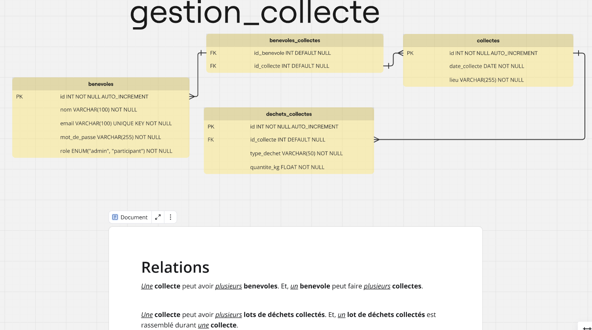

# Back-Office-App

Below is a detailed code review of this project along with suggestions for improvement. Overall, the project shows a good understanding of using components such as Symfony Routing, Twig for templating, PDO with prepared statements, and Monolog for logging. The project’s structure with controllers, models, views (Twig templates), and utilities is a good start toward a modular MVC‐like design. However, there are some areas where improvements could help increase maintainability, consistency, and security. Here are the key points:

## Demo Credentials

For demo purposes only, you can use the following credentials to explore the application:

- **Admin Account:**  
  Email: `admin@admin.admin`
  Password: `admin123`

- **User Account:**  
  Email: `user@user.user`
  Password: `user123`

> **Note:** These credentials are provided for testing and demonstration purposes only. These demo accounts are protected: they cannot be edited or deleted and do not have access to the "MyAccount" page.

## Model

---

### Strengths

- **Use of Modern Components:**  
  You’re using Symfony’s Routing component for URL matching, Twig for clean templating, and Monolog for error logging. This helps keep the code organized and maintainable.

- **Separation of Concerns:**  
  The code is split into controllers, models, views, and utilities. For example, business logic resides in controllers and models while the presentation is handled by Twig templates.

- **Security Practices:**  
  You are using prepared statements to avoid SQL injection, and you’ve implemented CSRF protection in your forms.

- **Error Handling:**  
  There is use of try-catch blocks and logging (with Monolog) in the front controller, which helps in catching and reporting errors.

---

### Areas for Improvement

1. **Project Structure & Consistency:**

   - While you already have a separation into directories (Controllers, Models, Views, Utilities), further consistency in naming (using one language for table and variable names) will improve readability.
   - Consider consolidating duplicated controllers/models (for collections and login) into single implementations.

2. **Error and Exception Handling:**

   - Although errors are caught and logged, error messages returned to the user (or stored in flash messages) are sometimes generic. Improving the granularity of error handling (without exposing sensitive details) could help both debugging and user experience.
   - Some SQL errors lead to a rollback, but you might also want to ensure that exceptions bubble up in a controlled way, perhaps by using a centralized error handler.

3. **Session and CSRF Token Management:**

   - CSRF tokens are generated and verified correctly; however, consider ensuring that the session is always started before any output is sent. You might centralize session initialization in a bootstrap file or middleware.

4. **Potential for Refactoring & DRY (Don’t Repeat Yourself):**

   - Common tasks such as CSRF checking, redirecting after form submissions, and retrieving pagination parameters could be abstracted further.
   - The HTML for buttons, forms, and error messages in your Twig templates can be further refactored into reusable components or macros to reduce duplication.

5. **Scalability Considerations:**

   - For a growing project, consider using a dependency injection container. Currently, controllers instantiate models and utilities directly, which can make unit testing harder.
   - Depending on your application’s size, you might look into an ORM (such as Doctrine) to reduce the need for handwritten SQL and to handle relationships more naturally.

6. **Coding Standards & Type Safety:**
   - Some functions have type hints (for example, in controllers that expect a `PDO` object) but others do not. Adopting strict typing (with `declare(strict_types=1);`) across the project can help catch errors early.
   - Ensure that all functions use consistent naming conventions and commenting so that new developers can easily follow the code.

---

### Detailed Suggestions

- **Improve Error Messages and Logging:**  
  Instead of generic error messages such as “Erreur de la base de données,” consider logging the full error details (while showing a user-friendly message to end users). You can also create custom exception classes for different error scenarios.

- **Enhance Session Management:**  
  Ensure session initialization is done in a bootstrap or front controller so that every page has the session started before any processing. You might also add methods to renew or invalidate tokens as needed.

- **Adopt a Dependency Injection Approach:**  
  Refactor controllers so that they receive their dependencies (such as the PDO instance or configuration objects) through constructor injection rather than instantiating them internally. This will make testing and maintenance easier.

- **Use a Templating Strategy for Reusable UI Components:**  
  Your Twig templates already include partials (e.g., `navbar.twig`, `action_buttons.twig`). You could further extend this by using Twig macros for common form elements or alerts to keep your views DRY.

- **Consider Framework Adoption:**  
  If the project continues to grow, you might consider adopting a full MVC framework (such as Symfony or Laravel) to handle routing, dependency injection, and ORM integration more robustly. This can also help standardize error handling, security, and testing practices.

- **Documentation & Comments:**  
  While many functions have comments, adding a project-level README with architectural decisions and documentation for API endpoints, database schema, and key utilities would be beneficial for future maintenance.

---

### Conclusion

The project demonstrates a solid foundation using modern PHP practices. With some refactoring to eliminate duplication, enforce naming consistency, improve error handling, and consider dependency injection, the project will become more maintainable and scalable. Addressing these suggestions will help streamline development and improve the overall code quality.
